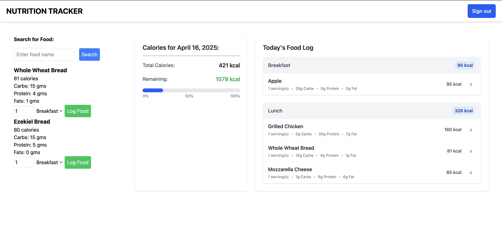

# README

# Nutrition Tracker 🍴 💫



A modern web application for tracking daily nutrition intake, built with Ruby on Rails 8.

## Overview

Nutrition Tracker allows users to log and monitor their daily food intake, track calories and nutrients, and maintain a healthy diet. The application features a user-friendly interface built with TailwindCSS and modern Rails techniques.

## Features  🚀:

- Search for foods and log your meals with a clean, fast interface 🔍

- Track daily calories, macros, and basic nutritional info 📊

- Connect with Ollama for smart food recognition (planning to add more LLM providers soon!)🤖

## Prerequisites

- **Ruby**: Version 3.4.2
- **Rails**: Version 8.0.2
- **MySQL**: Version 5.6.4 or higher

## Installation and Setup

### Clone the Repository

```bash
git clone https://github.com/yourusername/nutrition_tracker.git
cd nutrition_tracker
```

### Install Dependencies

```bash
# Install Ruby dependencies
bundle install


### Database Setup

```bash
# Create the database
rails db:create

# Run migrations
rails db:migrate

# Seed the database with initial data (if applicable)
rails db:seed
```

## Development Environment

### Start the Local Server

```bash
# Start the Rails server, CSS processing, and JS bundling
bin/dev
```

This will start the application on http://localhost:3000.

### Code Quality

The project uses the following tools for code quality:

- **Rubocop**: `bundle exec rubocop` for Ruby code linting
- **Brakeman**: `bundle exec brakeman` for security vulnerability scanning


## Environment Variables

For production deployments, you'll need to set the following environment variables:

- `NUTRITION_TRACKER_DATABASE_PASSWORD`: MySQL database password
- `RAILS_MASTER_KEY`: Master key for decrypting credentials
- `DATABASE_URL`: Optional database connection URL (alternative to individual settings)
- `RAILS_MAX_THREADS`: Number of threads per worker (default: 5)
- `RAILS_ENV`: Environment (production, development, test)
- `SECRET_KEY_BASE`: Used for session encryption in production

## Testing

The application uses the standard Rails testing framework.

```bash
# Run all tests
rails test

# Run system tests
rails test:system
```
